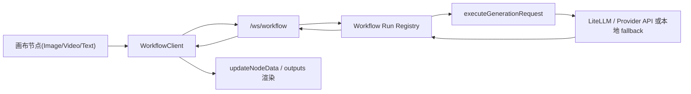

# HMDao WebSocket 工作流改造设计

## 1. 目标

将 HMDao 现有的“节点直接 HTTP 请求生成”链路，改造成“前端提交工作流 -> 后端编排执行 -> WebSocket 推送进度与结果”的统一工作流架构，同时保留现有画布交互、模型目录、API Key 管理与资源节点渲染能力。

## 2. 现状问题

当前链路主要是：

1. 画布节点触发 `generateNodeOutput`
2. 前端调用 `/api/proxy/:provider`
3. 后端同步代理大模型接口
4. 前端等待单次响应后更新节点

这套模式的问题：

1. 无统一任务状态，长耗时视频生成只能“等”
2. 无标准化进度事件，难以做断线恢复
3. 前后端无法统一描述多节点依赖执行
4. HTTP 与画布状态耦合较紧，不利于后续扩展为 DAG 工作流

## 3. 改造原则

1. 不引入第二套 Python 工作流服务，直接复用现有 Node 后端 `app/server/hmdao-api.mjs`
2. HTTP 代理与 WebSocket 工作流共用同一套生成执行内核
3. 节点 UI 保持不变，优先替换传输与编排层
4. 先支持单节点工作流，协议与数据结构保留多节点 DAG 扩展位

## 4. 改造后链路



## 5. 协议

### 5.1 客户端 -> 服务端

#### `workflow:create`

```json
{
  "msg_id": "wfreq-xxx",
  "msg_type": "workflow:create",
  "payload": {
    "workflow": {
      "name": "image-node-1",
      "nodes": [
        {
          "node_id": "node-1",
          "nodeType": "image",
          "provider": "siliconflow",
          "model": "lib-image",
          "prompt": "生成海报",
          "endpoint": "/images/generations",
          "body": { "model": "lib-image", "prompt": "生成海报" },
          "apiKey": "xxx",
          "timeout": 90000,
          "depends_on": []
        }
      ]
    }
  }
}
```

#### `status:query`

用于重连后的状态恢复。

#### `workflow:control`

当前支持 `cancel`。

### 5.2 服务端 -> 客户端

1. `workflow:accepted`
2. `workflow:started`
3. `node:started`
4. `node:completed`
5. `node:failed`
6. `workflow:completed`
7. `workflow:failed`
8. `workflow:cancelled`
9. `status:result`
10. `error`

## 6. 前端模块

### `app/src/services/workflow/WorkflowClient.ts`

职责：

1. 管理 `/ws/workflow` 连接
2. 自动重连与心跳
3. 请求/工作流关联
4. 断线后的状态恢复查询
5. 将工作流完成结果回传给调用节点

### `app/src/services/generation.ts`

职责变化：

1. 保留参数构建、校验、结果完整性校验
2. 优先走 WorkflowClient
3. 当 WebSocket 不可用时回退到原有 `/api/proxy/:provider`

## 7. 后端模块

### `app/server/hmdao-api.mjs`

新增：

1. `/ws/workflow` WebSocket 升级入口
2. `workflowRuns` 运行注册表
3. `executeWorkflowRun` 工作流执行器
4. `workflowStatusSnapshot` 状态快照
5. `publishWorkflowEvent` 事件广播

复用：

1. `realProxy`
2. `activatedProviders`
3. `MODEL_CATALOG`
4. fallback 资源生成

### `executeGenerationRequest`

统一单节点执行内核，HTTP 与 WS 都走它。

## 8. 迁移策略

### 第一阶段

1. 保留 `/api/proxy/:provider`
2. 前端图片/视频/文本生成优先使用 WebSocket
3. WS 失败则自动回退 HTTP

### 第二阶段

1. 支持多节点依赖执行
2. 支持节点级进度 `node:progress`
3. 支持工作流持久化与恢复

## 9. 需要继续补充的点

1. 二进制大文件分块传输
2. 视频生成实时进度映射
3. 持久化任务历史
4. DAG 循环依赖校验前置
5. 节点级重试策略

## 10. 验证要求

### 终端验证

1. `npm run verify:terminal`
2. `npm run verify:workflow-ws`

### 浏览器验证

1. 登录
2. 激活模型
3. 图片节点生成
4. 视频节点生成
5. 画布仍可选中、拖拽、渲染资源

## 11. 与乱码 TXT 文档的关系

`C:\Users\123\Desktop\WebSocket工作流.txt` 原文存在明显编码损坏，且内容指向另一套 Python/FastAPI 架构。当前文档保留其“WebSocket 工作流 + 进度推送 + DAG 扩展”的核心思路，但已按 HMDao 现有代码结构重新整理为可直接落地维护的版本。
